# Tugas SSH Ubuntu - SK3A Unsri Indralaya

## Deskripsi Tugas
Tugas ini bertujuan untuk mengonfigurasi koneksi SSH antara Ubuntu Desktop dan Ubuntu Server. Langkah-langkah yang dilakukan termasuk instalasi SSH, pengaturan port, dan pengujian koneksi melalui VirtualBox.

## Langkah-Langkah
1. **Instalasi SSH di Ubuntu Server**
2. **Pengaturan Port SSH**
3. **Pengujian Koneksi dengan Ping**
4. **Remote Login menggunakan SSH**
5. **Pengujian Perintah Dasar di Server**

# Laporan Instalasi dan Konfigurasi SSH pada Ubuntu Server

## Deskripsi Singkat
Laporan ini menjelaskan proses instalasi dan konfigurasi SSH pada Ubuntu Server yang berjalan di VirtualBox. Tujuan dari tugas ini adalah menghubungkan Ubuntu Desktop dengan Ubuntu Server menggunakan SSH untuk remote management, termasuk mengubah port SSH dan melakukan pengujian koneksi.

## Pendahuluan
Dalam tugas ini, kami menghubungkan Ubuntu Desktop dengan Ubuntu Server menggunakan SSH untuk memungkinkan remote management. Alat dan software yang digunakan adalah:
- **Linux Ubuntu Desktop** (untuk remote management)
- **Linux Ubuntu Server** (sebagai target yang diakses)
- **VirtualBox** untuk menjalankan mesin virtual Ubuntu Server
- **SSH** sebagai protokol untuk remote login

## Langkah-Langkah dan Konfigurasi

### 1. Instalasi SSH
Instalasi SSH pada Ubuntu Server dilakukan dengan perintah berikut:
```bash
sudo apt update
sudo apt install openssh-server
```
Setelah instalasi, layanan SSH akan otomatis aktif.

### 2. Pengaturan Port SSH
Setelah SSH berhasil diinstal, port default SSH (22) diubah menjadi 40 untuk alasan keamanan. Langkah-langkahnya adalah:
1. Buka file konfigurasi SSH:
   ```bash
   sudo nano /etc/ssh/sshd_config
   ```
2. Cari baris yang bertuliskan `#Port 22`, hapus tanda `#`, dan ubah angkanya menjadi `40`:
   ```plaintext
   Port 40
   ```
3. Simpan perubahan dan keluar dari editor.
4. Restart layanan SSH agar perubahan port berlaku:
   ```bash
   sudo systemctl restart ssh
   ```

### 3. Pengaturan Firewall (UFW)
Periksa status firewall pada server menggunakan perintah:
```bash
sudo ufw status
```
Jika firewall aktif, tambahkan aturan untuk mengizinkan port 40:
```bash
sudo ufw allow 40/tcp
```
Namun, pada contoh ini, status firewall adalah **inactive**, jadi tidak perlu penyesuaian aturan.

### 4. Tes Koneksi dengan Ping
Lakukan tes koneksi dari Ubuntu Desktop ke Ubuntu Server untuk memastikan kedua mesin terhubung:
```bash
ping [IP Address Ubuntu Server]
```
Hasil yang diharapkan adalah respon `64 bytes from [IP Address]`, yang menunjukkan koneksi berjalan dengan baik.

### 5. Remote Login Menggunakan SSH
Setelah memastikan koneksi jaringan, login ke Ubuntu Server dari Ubuntu Desktop menggunakan perintah:
```bash
ssh -p 40 [username]@[IP Address Ubuntu Server]
```
Jika berhasil, prompt akan berubah menjadi shell Ubuntu Server, menandakan bahwa Anda sudah terhubung.

## Pengujian Perintah Dasar di Server
Setelah terhubung, beberapa perintah dasar dapat dijalankan untuk memastikan akses penuh ke server:
-Tentu, berikut adalah README yang sudah diterjemahkan ke dalam Bahasa Indonesia:

```markdown
# Pengujian Perintah Dasar pada Ubuntu Server

README ini mendokumentasikan perintah-perintah dasar yang digunakan untuk menguji koneksi dan konfigurasi Ubuntu Server dari lingkungan Ubuntu Desktop.

## Perintah yang Digunakan

1. **Ping Google**  
   ```bash
   ping google.com
   ```
   Perintah ini memeriksa konektivitas ke server Google untuk memastikan koneksi internet.

2. **Menampilkan Direktori**  
   ```bash
   ls
   ```
   Menampilkan isi direktori saat ini untuk memverifikasi struktur file.

3. **Menampilkan Direktori Kerja Saat Ini**  
   ```bash
   pwd
   ```
   Menunjukkan jalur lengkap dari direktori kerja saat ini.

4. **Memeriksa Versi Ubuntu**  
   ```bash
   lsb_release -a
   ```
   Memberikan detail tentang versi Ubuntu yang berjalan di server.

5. **Memantau Proses Sistem**  
   ```bash
   top
   ```
   Menampilkan informasi real-time tentang proses sistem, berguna untuk memantau kinerja server.

6. **Restart Sistem**  
   ```bash
   sudo reboot
   ```
   Merestart server untuk memastikan konfigurasi telah dimuat dengan benar setelah perubahan.

## Tujuan

Perintah di atas dieksekusi untuk:
- Memastikan konektivitas jaringan
- Memeriksa organisasi sistem file
- Memeriksa detail dan versi sistem
- Memantau kinerja sistem
- Menguji stabilitas server dengan restart

## Catatan

Pastikan Anda memiliki izin yang diperlukan untuk menjalankan perintah `sudo`. Gunakan perintah-perintah ini dengan hati-hati, terutama pada server yang sedang aktif.
```
## Dokumentasi Langkah-Langkah Konfigurasi SSH

1. **Gambar 11**
   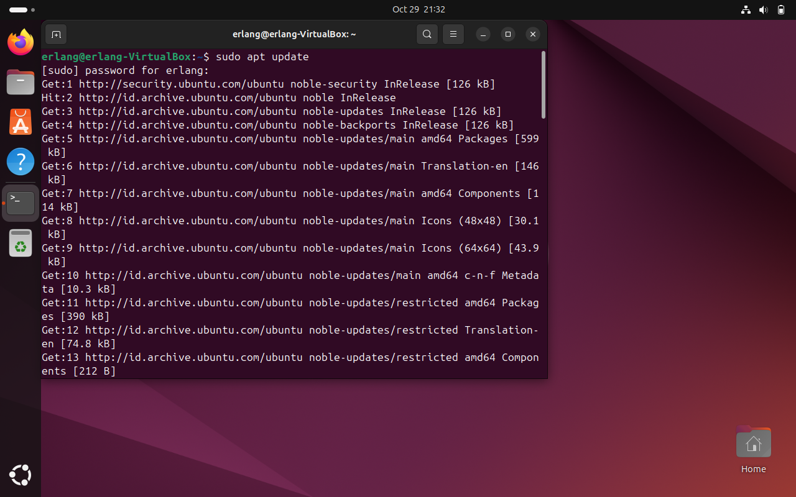

2. **Gambar 12**
   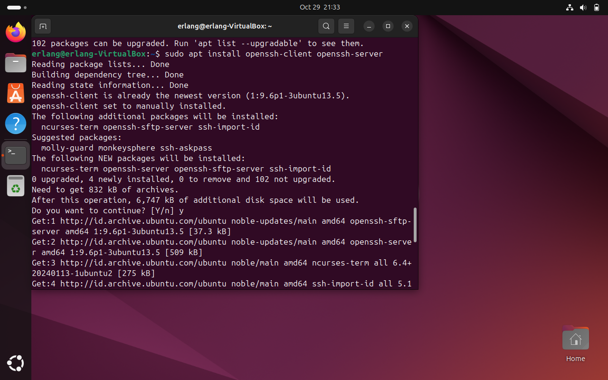

3. **Gambar 13**
   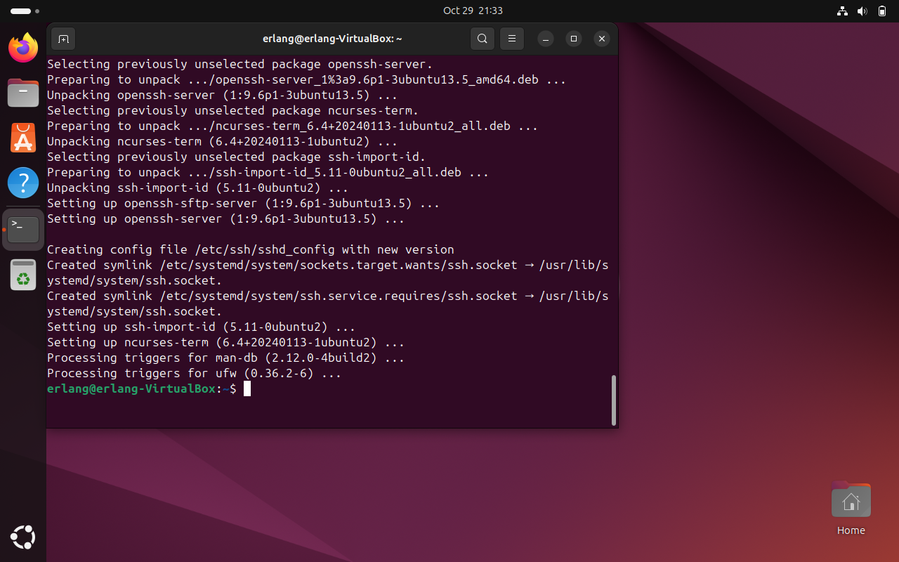

4. **Gambar 14**
   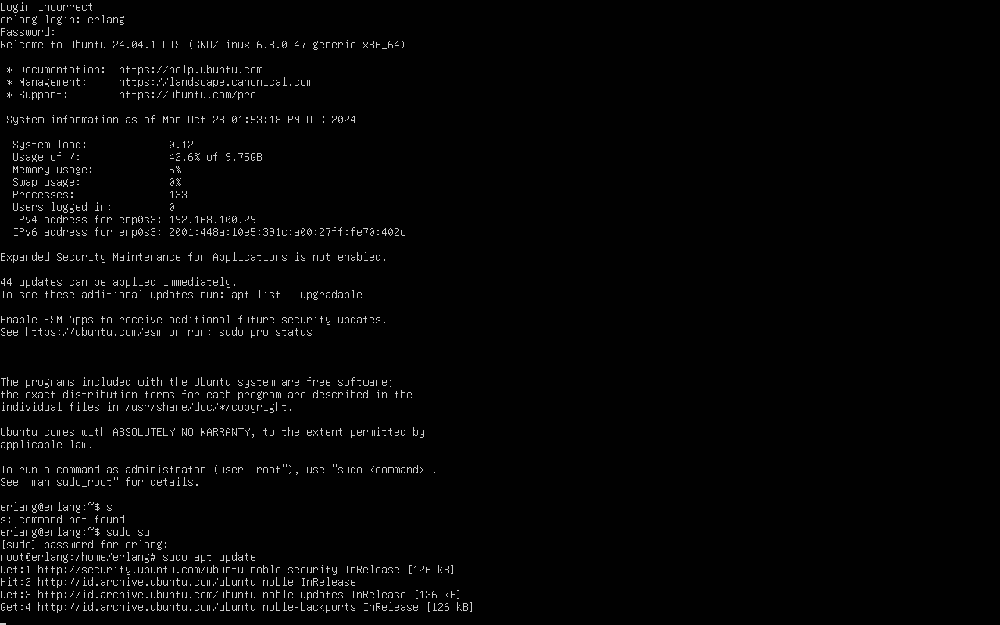

5. **Gambar 15**
   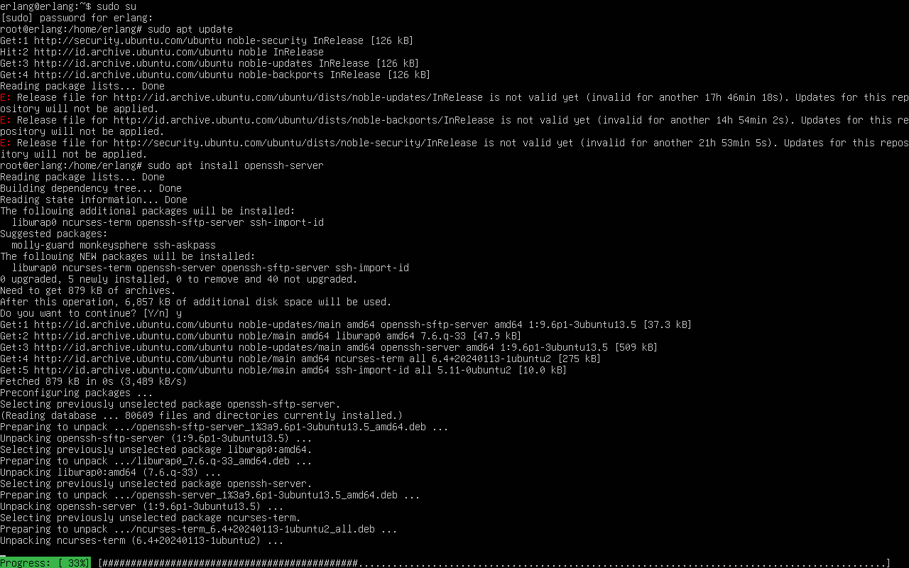

6. **Gambar 16**
   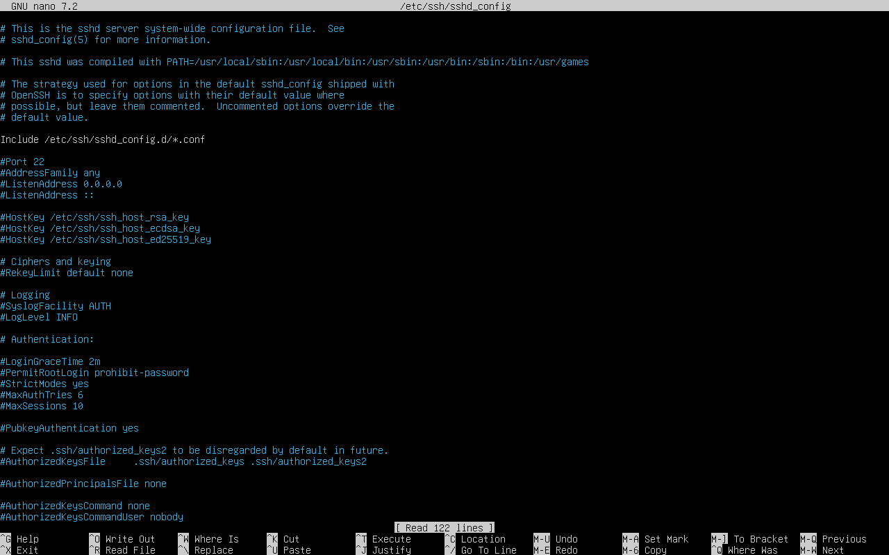

7. **Gambar 17**
   

8. **Gambar 18**
   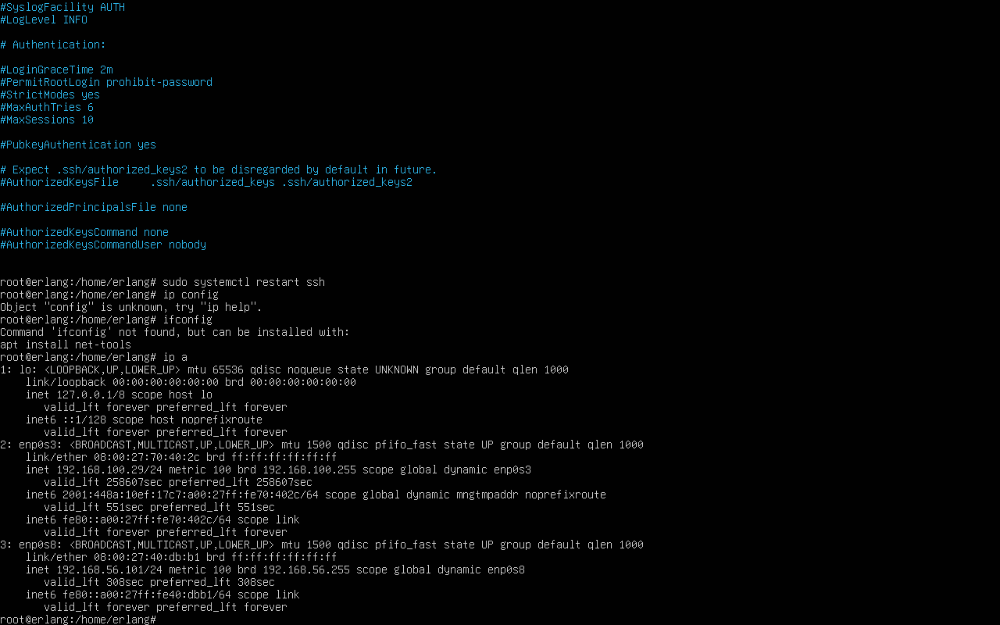

9. **Gambar 19**
   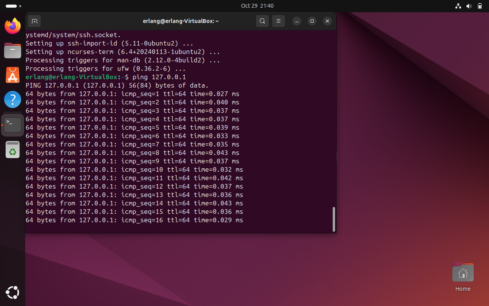

10. **Gambar 20**
    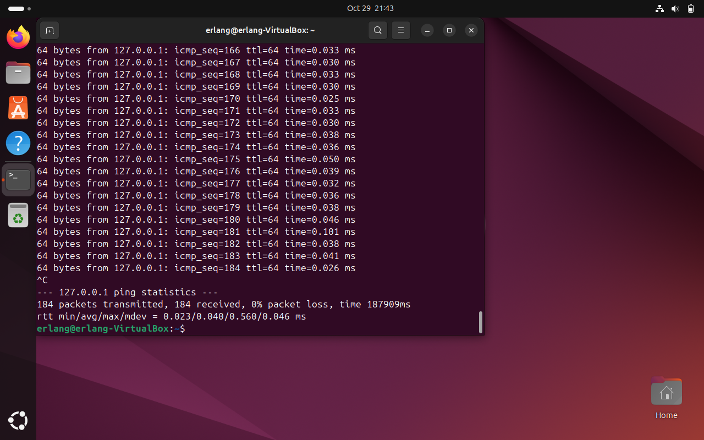

11. **Gambar 21**
    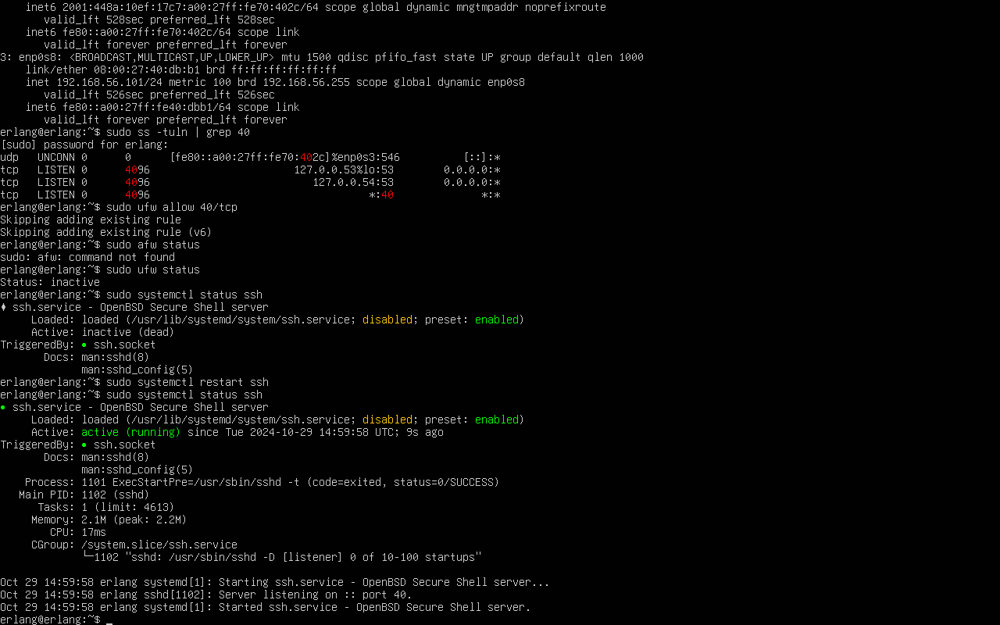

12. **Gambar 22**
    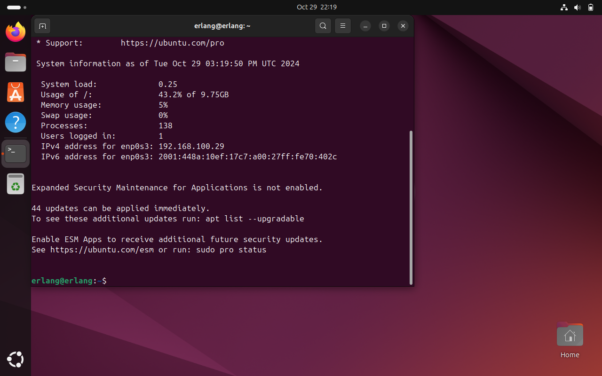


## Kesimpulan
Dengan mengikuti langkah-langkah di atas, Ubuntu Desktop dapat terhubung dan mengendalikan Ubuntu Server melalui koneksi SSH dengan port yang telah diubah. Konfigurasi ini memungkinkan pengelolaan server secara remote dan aman.


